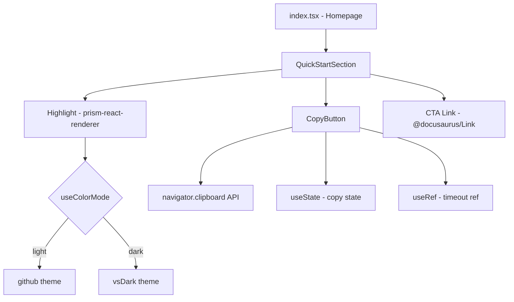
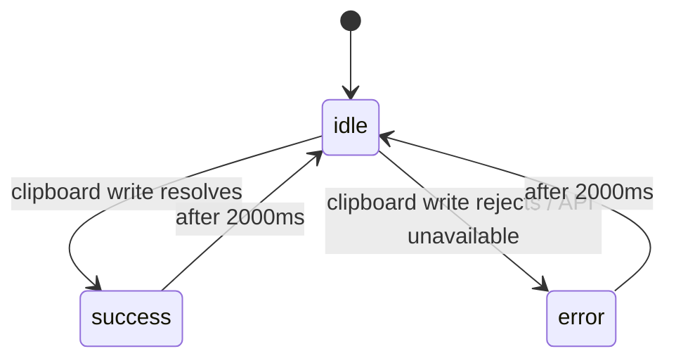

# Design Document: Homepage QuickStart Section

## Overview

This document describes the technical design for the `QuickStartSection` component — a new homepage section for the Soroban Cookbook site that displays a syntax-highlighted Rust/Soroban code snippet, a copy-to-clipboard button with timed feedback, and a CTA link to the full setup guide.

The feature integrates with the existing Docusaurus 3.x infrastructure: it reuses `prism-react-renderer` (already a Docusaurus dependency), Docusaurus CSS custom properties for theming, and the `useColorMode` hook for theme awareness. No new third-party runtime dependencies are required.

The component is inserted into the existing homepage (`src/pages/index.tsx`) between the hero/pattern section and the `NewsletterSignup` component.

---

## Architecture

The feature is a single self-contained React component with an accompanying CSS Module. It has no external data dependencies and no server-side logic.



**Key architectural decisions:**

- `prism-react-renderer` is used directly (not Docusaurus's `CodeBlock` theme component) to give precise control over the rendered markup and avoid Docusaurus's opinionated wrapper chrome (copy button, language badge, etc.).
- The copy feedback timer is managed with `useRef` to hold the timeout ID, preventing stale-closure bugs and ensuring cleanup on unmount.
- All colors are expressed via Docusaurus CSS custom properties so the component inherits theme changes automatically without JavaScript.

---

## Components and Interfaces

### `QuickStartSection`

**File:** `documentation/src/components/QuickStartSection/index.tsx`

The top-level section component. Renders the heading, `CodeBlock`, `CopyButton`, and CTA link.

```typescript
// No external props — the snippet content is a module-level constant.
export default function QuickStartSection(): ReactNode
```

**Internal constants:**

```typescript
const SNIPPET = `\
#![no_std]
use soroban_sdk::{contract, contractimpl, Env, Symbol, symbol_short};

#[contract]
pub struct HelloContract;

#[contractimpl]
impl HelloContract {
    pub fn hello(env: Env, to: Symbol) -> Symbol {
        symbol_short!("Hello")
    }
}`;
```

### `CopyButton`

An internal sub-component (not exported) that encapsulates copy state.

```typescript
type CopyState = 'idle' | 'success' | 'error';

interface CopyButtonProps {
  text: string; // The string to write to the clipboard
}

function CopyButton({ text }: CopyButtonProps): ReactNode
```

**State machine:**



Label and aria-label mapping:

| State   | Visible label | aria-label       |
|---------|---------------|------------------|
| idle    | Copy          | Copy code        |
| success | Copied!       | Code copied      |
| error   | Failed        | Copy failed      |

The button is `disabled` while in `success` or `error` state.

### CSS Module

**File:** `documentation/src/components/QuickStartSection/styles.module.css`

Scoped styles for layout, code block container, and button. All color values use Docusaurus CSS custom properties. No hardcoded hex values for colors.

---

## Data Models

The component has no persistent data model. The only runtime state is the `CopyState` enum held in `useState` within `CopyButton`.

```typescript
// Timeout ref type — holds the browser timer ID for cleanup
const timerRef = useRef<ReturnType<typeof setTimeout> | null>(null);
```

The Prism theme objects (`prismThemes.github` / `prismThemes.vsDark`) are imported from `prism-react-renderer` and selected at render time based on `useColorMode().colorMode`.

---

## Correctness Properties

*A property is a characteristic or behavior that should hold true across all valid executions of a system — essentially, a formal statement about what the system should do. Properties serve as the bridge between human-readable specifications and machine-verifiable correctness guarantees.*

### Property 1: Theme selects correct Prism theme

*For any* active Docusaurus color mode value (`light` or `dark`), the `Highlight` component from `prism-react-renderer` must receive the corresponding Prism theme object — `prismThemes.github` for light and `prismThemes.vsDark` for dark.

**Validates: Requirements 2.2, 2.3**

---

### Property 2: Copy button writes full snippet to clipboard

*For any* invocation of the `CopyButton` while in `idle` state, clicking it must call `navigator.clipboard.writeText` with the exact, unmodified snippet string passed as the `text` prop.

**Validates: Requirements 3.2**

---

### Property 3: Copy feedback label and revert

*For any* clipboard outcome (success or failure), after the `CopyButton` is activated:
- the button label must immediately change to the outcome-appropriate label (`"Copied!"` or `"Failed"`),
- and after exactly 2000 ms the label must revert to `"Copy"`.

**Validates: Requirements 3.3, 3.4**

---

### Property 4: Button disabled during feedback

*For any* clipboard outcome, while the `CopyButton` is displaying a success or error label (i.e., within the 2000 ms window), the button element must have the `disabled` attribute set, preventing re-activation.

**Validates: Requirements 3.5**

---

### Property 5: aria-label reflects copy state

*For any* `CopyState` value (`idle`, `success`, `error`), the `CopyButton`'s `aria-label` attribute must equal the state-specific accessible name defined in the label mapping table above.

**Validates: Requirements 3.6**

---

### Property 6: No horizontal overflow across viewport widths

*For any* viewport width between 320 px and 1440 px, the `QuickStartSection` container's `scrollWidth` must not exceed its `clientWidth` (i.e., no horizontal overflow on the section itself).

**Validates: Requirements 5.1**

---

### Property 7: Theme change updates section colors reactively

*For any* theme transition (light → dark or dark → light), the `QuickStartSection` must reflect the new theme's CSS custom property values without a page reload, because all color declarations reference `--ifm-*` variables that Docusaurus updates on the `:root` / `[data-theme]` selector.

**Validates: Requirements 6.1**

---

### Property 8: Code block background is visually distinct from section background

*For any* active theme, the CSS custom property used for the code block's background must resolve to a different value than the CSS custom property used for the surrounding section background.

- Light: code block uses `--ifm-background-surface-color` (`#f8f9fa`), section uses `--ifm-background-color` (`#ffffff`)
- Dark: code block uses a dark surface (`#1e1e2e` via the existing dark-mode `pre` override), section uses `--ifm-background-color` (`#0f172a`)

**Validates: Requirements 6.4**

---

## Error Handling

| Scenario | Handling |
|---|---|
| `navigator.clipboard` is `undefined` (non-HTTPS or old browser) | `CopyButton` catches the reference error in the `try/catch` block and transitions to `error` state |
| `clipboard.writeText` promise rejects | `.catch()` handler transitions to `error` state |
| Component unmounts while 2000 ms timer is running | `useEffect` cleanup clears the timeout via `timerRef.current` to prevent state updates on unmounted component |
| SSR (Docusaurus static build) | `navigator` is not available server-side; the clipboard call is inside a click handler (client-only), so no SSR error occurs |

---

## Testing Strategy

### Dual approach

Both unit tests and property-based tests are required. Unit tests cover specific structural examples and edge cases; property tests verify universal behavioral guarantees across generated inputs.

### Unit tests (Jest + React Testing Library)

Focus areas:
- Section renders with heading, exactly one code block, one copy button, one CTA link (Requirements 1.1–1.4, 3.1, 4.1–4.4)
- CTA link `href` is `/docs/getting-started/setup` and has no `target="_blank"` (Requirements 4.2, 4.3)
- Code block does not have `contentEditable` (Requirement 1.4)
- Prism token spans are present in rendered output (Requirement 2.4)
- Copy button has minimum 44×44 px touch target (Requirement 5.4)
- CSS module contains no hardcoded hex color values (Requirements 6.2, 6.3)
- Mobile viewport: code block container has `overflow-x: auto` (Requirement 5.2)

### Property-based tests (fast-check + Jest)

`fast-check` is the chosen PBT library for TypeScript. Each property test runs a minimum of 100 iterations.

**Property 1 — Theme selects correct Prism theme**
```
// Feature: homepage-quickstart, Property 1: theme selects correct Prism theme
fc.assert(fc.property(
  fc.constantFrom('light', 'dark'),
  (colorMode) => { /* render with mocked useColorMode, assert Highlight receives correct theme */ }
), { numRuns: 100 });
```

**Property 2 — Copy button writes full snippet**
```
// Feature: homepage-quickstart, Property 2: copy button writes full snippet to clipboard
fc.assert(fc.property(
  fc.string({ minLength: 1 }),  // arbitrary snippet text
  async (snippet) => { /* render CopyButton with text=snippet, click, assert writeText called with snippet */ }
), { numRuns: 100 });
```

**Property 3 — Feedback label and revert**
```
// Feature: homepage-quickstart, Property 3: copy feedback label and revert
fc.assert(fc.property(
  fc.boolean(),  // true = success, false = failure
  async (succeeds) => { /* mock clipboard, click, assert label, advance 2000ms, assert revert */ }
), { numRuns: 100 });
```

**Property 4 — Button disabled during feedback**
```
// Feature: homepage-quickstart, Property 4: button disabled during feedback
fc.assert(fc.property(
  fc.boolean(),
  async (succeeds) => { /* click, assert disabled=true, advance 2000ms, assert disabled=false */ }
), { numRuns: 100 });
```

**Property 5 — aria-label reflects state**
```
// Feature: homepage-quickstart, Property 5: aria-label reflects copy state
fc.assert(fc.property(
  fc.constantFrom('idle', 'success', 'error'),
  (state) => { /* render CopyButton in given state, assert aria-label matches mapping */ }
), { numRuns: 100 });
```

**Property 6 — No horizontal overflow**
```
// Feature: homepage-quickstart, Property 6: no horizontal overflow across viewport widths
fc.assert(fc.property(
  fc.integer({ min: 320, max: 1440 }),
  (width) => { /* set jsdom viewport width, render section, assert scrollWidth <= clientWidth */ }
), { numRuns: 100 });
```

**Property 7 — Theme change updates colors reactively**
```
// Feature: homepage-quickstart, Property 7: theme change updates section colors reactively
fc.assert(fc.property(
  fc.constantFrom('light', 'dark'),
  (theme) => { /* set data-theme attribute, render section, assert CSS vars resolve correctly */ }
), { numRuns: 100 });
```

**Property 8 — Code block background distinct from section background**
```
// Feature: homepage-quickstart, Property 8: code block background distinct from section background
fc.assert(fc.property(
  fc.constantFrom('light', 'dark'),
  (theme) => { /* set theme, render, assert code block bg !== section bg */ }
), { numRuns: 100 });
```
