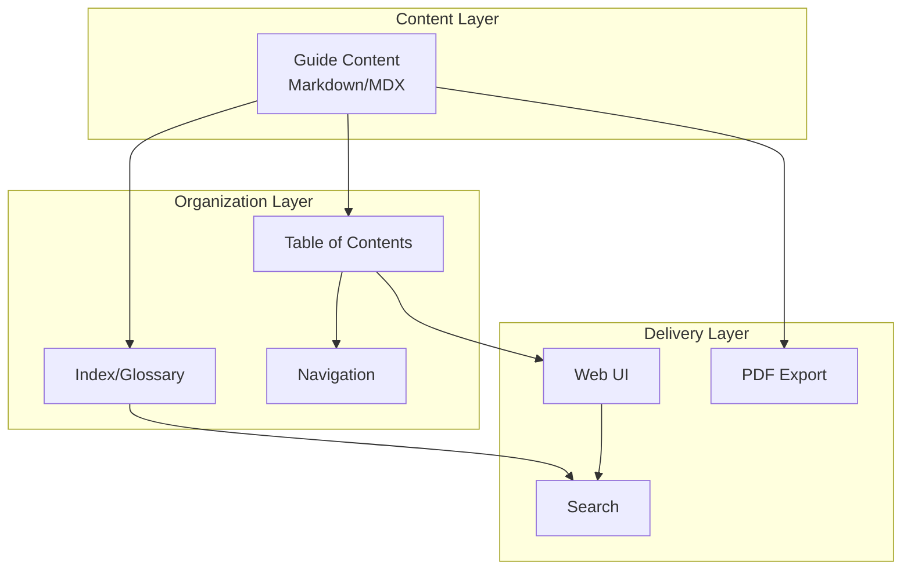

# Testing Strategy Guide - Design Document

## Overview

The Testing Strategy Guide is a comprehensive, architecture-agnostic documentation resource that helps development teams design, implement, and optimize their testing practices. The guide follows a progressive disclosure pattern, starting from foundational concepts (test pyramid) and advancing through intermediate techniques (fixtures, property-based testing) to sophisticated strategies (CI/CD integration, security testing, maturity-based mapping).

The guide is structured to serve multiple audiences: development team leads seeking test pyramid implementation guidance, test engineers needing fixture patterns, QA engineers exploring property-based testing, DevOps engineers integrating testing into pipelines, product managers managing regression testing, security engineers incorporating security testing, and engineering directors mapping strategies to organizational maturity.

### Design Goals

1. **Actionable**: Every concept includes implementation examples that teams can apply immediately
2. **Tool-Agnostic**: Focus on patterns and concepts rather than specific tool implementations
3. **Progressive**: Content flows from basic to advanced with clear prerequisite indicators
4. **Multi-Language**: Examples use pseudocode or demonstrate patterns in at least 2 languages
5. **Comprehensive**: Cover all 7 user stories with their acceptance criteria

---

## Architecture

### High-Level Architecture

The Testing Strategy Guide is a documentation system with the following architectural components:



### Content Architecture

The guide follows a layered content architecture:

1. **Foundation Layer**: Test pyramid fundamentals, basic test types
2. **Intermediate Layer**: Fixtures, property-based testing, test organization
3. **Advanced Layer**: CI/CD integration, regression strategies, security testing
4. **Strategic Layer**: Maturity-based mapping, cost-benefit analysis

Each layer builds upon the previous, enabling teams to progress through the guide systematically.

---

## Components and Interfaces

### Document Structure Components

| Component | Purpose | Interface |
|-----------|---------|-----------|
| Section | Primary content unit | Title, body, examples, exercises |
| Subsection | Detailed exploration | Parent section, nested content |
| Code Example | Implementation demonstration | Language tag, syntax highlighting, annotations |
| Pattern Card | Reusable solution template | Name, context, problem, solution, tradeoffs |
| Decision Point | Architectural choices | Option A, Option B, tradeoffs, recommendations |
| Maturity Matrix | Capability mapping | Level, techniques, tools, metrics |

### Navigation Components

- **Progress Indicator**: Shows current position in guide hierarchy
- **Prerequisite Badges**: Indicates required prior knowledge
- **Cross-Reference Links**: Connects related sections
- **Quick Reference Cards**: Condensed summaries for key patterns

### Example Components

- **Runnable Examples**: Code that can be executed in context
- **Configuration Snippets**: CI/CD configs, tool setups
- **Comparison Tables**: Side-by-side technique evaluation
- **Decision Trees**: Step-by-step selection guidance

---

## Data Models

### Content Metadata Model

```typescript
interface Section {
  id: string;
  title: string;
  level: 1 | 2 | 3 | 4;
  prerequisites: string[];
  learningObjectives: string[];
  content: ContentBlock[];
  examples: Example[];
  exercises: Exercise[];
}

interface ContentBlock {
  type: 'prose' | 'code' | 'diagram' | 'table' | 'callout';
  variant?: 'info' | 'warning' | 'tip' | 'danger';
  content: string | CodeBlock | DiagramSpec | TableData;
}

interface Pattern {
  name: string;
  category: 'fixture' | 'organization' | 'security' | 'regression';
  context: string;
  problem: string;
  solution: string;
  tradeoffs: Tradeoff[];
  languages: string[];
}

interface MaturityLevel {
  name: 'startup' | 'growth' | 'enterprise';
  characteristics: string[];
  recommendedTechniques: Technique[];
  metrics: Metric[];
  transitionCriteria: string[];
}
```

### Navigation Model

```typescript
interface GuideTOC {
  sections: TOCSection[];
  crossReferences: Map<string, string[]>;
  searchIndex: SearchIndex;
}

interface TOCSection {
  id: string;
  title: string;
  path: string[];
  children?: TOCSection[];
}
```

---

## Correctness Properties

*A property is a characteristic or behavior that should hold true across all valid executions of a system—essentially, a formal statement about what the system should do. Properties serve as the bridge between human-readable specifications and machine-verifiable correctness guarantees.*

### Property 1: Test Pyramid Content Coverage

*For any* guide implementation, the content must include three distinct sections covering unit, integration, and end-to-end testing with concrete examples for each

**Validates: US-1.1, US-1.2**

### Property 2: Distribution Recommendations

*For any* test pyramid section, there must be explicit percentage or ratio recommendations for test distribution across the three layers

**Validates: US-1.3**

### Property 3: Measurement Guidance

*For any* test pyramid section, there must be guidance on measuring current distribution and adjusting the balance

**Validates: US-1.4**

### Property 4: Fixture Pattern Coverage

*For any* fixture section, it must demonstrate at least three distinct patterns: factory, builder, and object mother

**Validates: US-2.1**

### Property 5: Data Management Completeness

*For any* fixture section, it must cover data cleanup strategies and performance considerations for large datasets

**Validates: US-2.2, US-2.3**

### Property 6: Property-Based Testing Foundation

*For any* property-based testing section, it must explain core concepts, property definition methodology, and shrinking behavior

**Validates: US-3.1, US-3.2, US-3.3**

### Property 7: Framework Integration

*For any* property-based testing section, it must demonstrate integration with at least one existing test framework

**Validates: US-3.4**

### Property 8: Pipeline Mapping

*For any* CI/CD section, there must be a clear mapping of test types to pipeline stages

**Validates: US-4.1**

### Property 9: Optimization and Tradeoffs

*For any* CI/CD section, it must cover performance optimization, failure handling, and speed versus coverage tradeoffs

**Validates: US-4.2, US-4.3, US-4.4**

### Property 10: Regression Strategy Coverage

*For any* regression testing section, it must cover test selection, prioritization, automated generation, and effectiveness metrics

**Validates: US-5.1, US-5.2, US-5.3, US-5.4**

### Property 11: Security Testing Integration

*For any* security testing section, it must cover tool integration, test cases, threat modeling, and security property testing

**Validates: US-6.1, US-6.2, US-6.3, US-6.4**

### Property 12: Maturity Level Definition

*For any* maturity section, it must define at least three distinct maturity levels with mapped techniques, transition guidance, and cost-benefit analysis

**Validates: US-7.1, US-7.2, US-7.3, US-7.4**

### Property 13: Code Example Presence

*For any* major section in the guide, there must be at least one code example or configuration snippet

**Validates: NFR-1**

### Property 14: Pattern Diversity

*For any* guide implementation, there must be at least five distinct testing patterns demonstrated with examples

**Validates: NFR-2**

### Property 15: CI System Coverage

*For any* CI/CD integration section, there must be specific configuration examples for at least two different CI systems

**Validates: NFR-3**

### Property 16: Multi-Language Examples

*For any* code examples in the guide, patterns must be demonstrated in at least two different programming languages

**Validates: NFR-4**

### Property 17: Progressive Structure

*For any* guide organization, sections must have clear progression indicators and prerequisite markers

**Validates: NFR-5**

---

## Error Handling

### Content Error Handling

- **Broken Links**: Automated link validation in CI, fallback to cross-reference search
- **Outdated Examples**: Version stamps on examples, community contribution process for updates
- **Inconsistent Terminology**: Centralized glossary, linter checks for term usage
- **Missing Translations**: Language indicator badges, fallback to primary language

### Example Error Handling

- **Non-Runnable Code**: Annotation system marking examples as "illustrative" vs "executable"
- **Framework Version Drift**: Version pins in dependency specifications, update cadence documentation
- **Environment-Specific Issues**: Platform-specific callouts and troubleshooting sections

---

## Testing Strategy

### Verification Approach

The guide content itself will be verified through:

1. **Structure Validation**: Automated checks that all required sections exist
2. **Link Integrity**: Validation that all cross-references resolve correctly
3. **Code Example Validation**: Syntax checking and, where possible, execution validation
4. **Prerequisite Mapping**: Verification that prerequisites are satisfied before advanced sections

### Quality Assurance

- **Technical Review**: Expert reviewers validate implementation guidance
- **Language Consistency**: Automated checks for terminology consistency
- **Accessibility**: Structure supports screen reader navigation
- **Searchability**: Full-text search index with relevance ranking

### Content Evolution

- **Version Control**: All content in version control with clear change history
- **Community Feedback**: Issue tracking for corrections and enhancements
- **Update Cadence**: Quarterly review cycle for accuracy and relevance

---

## Implementation Patterns for Each Testing Technique

### Test Pyramid Implementation

| Layer | Focus | Tools | Distribution |
|-------|-------|-------|--------------|
| Unit | Individual components | Jest, pytest, JUnit | 70% |
| Integration | Component interactions | TestNG, Mocha | 20% |
| E2E | Full workflows | Cypress, Playwright | 10% |

### Fixture Patterns

- **Factory**: Creates test data on demand with configurable attributes
- **Builder**: Fluent API for constructing complex test objects
- **Object Mother**: Canonical examples of domain objects

### Property-Based Testing Integration

- **Concept**: Define properties that must hold for all valid inputs
- **Shrinking**: Automatic reduction of failing cases to minimal examples
- **Framework Integration**: Libraries for Python (Hypothesis), JavaScript (fast-check), Java (QuickTheories)

### CI/CD Pipeline Mapping

| Pipeline Stage | Test Types | Timing | Gate |
|---------------|------------|--------|------|
| Commit | Unit tests | < 5 min | Block |
| Integration | Integration tests | < 15 min | Block |
| Deployment | E2E tests | < 30 min | Optional |
| Post-Deploy | Smoke tests | Real-time | Alert |

### Regression Testing Patterns

- **Test Selection**: Impact analysis to run only affected tests
- **Prioritization**: Risk-based ordering of test execution
- **Metrics**: Coverage, execution time, failure rate tracking

### Security Testing Integration

- **Static Analysis**: SAST tools integrated at commit stage
- **Dynamic Analysis**: DAST during integration testing
- **Dependency Scanning**: SCA for vulnerable dependencies
- **Security Properties**: Property-based tests for security invariants

### Maturity Level Mapping

| Level | Characteristics | Testing Focus | Investment |
|-------|-----------------|---------------|------------|
| Startup | Speed first, minimal process | Unit tests, basic integration | Low |
| Growth | Scale, reliability matters | Pyramid balance, CI integration | Medium |
| Enterprise | Compliance, predictability | Full strategy, security, metrics | High |

---

## Integration with CI/CD Systems

### GitHub Actions Example

```yaml
name: Test Pipeline
on: [push, pull_request]
jobs:
  unit-tests:
    runs-on: ubuntu-latest
    steps:
      - uses: actions/checkout@v4
      - name: Run unit tests
        run: npm test -- --coverage
  integration-tests:
    needs: unit-tests
    runs-on: ubuntu-latest
    steps:
      - name: Run integration tests
        run: npm run test:integration
  e2e-tests:
    needs: integration-tests
    runs-on: ubuntu-latest
    steps:
      - name: Run E2E tests
        run: npm run test:e2e
```

### GitLab CI Example

```yaml
stages:
  - test
  - integrate
  - deploy

unit:
  stage: test
  script:
    - npm test -- --coverage
  coverage: '/Coverage: \d+\.\d+%/'

integration:
  stage: integrate
  script:
    - npm run test:integration

e2e:
  stage: deploy
  script:
    - npm run test:e2e
  when: manual
```

---

## Examples and Code Snippets Structure

### Code Example Template

```markdown
:::info Language: JavaScript
This example demonstrates the factory pattern
:::

```javascript
// Factory function for creating test users
function createUser(overrides = {}) {
  return {
    id: uuid(),
    name: 'Test User',
    email: 'test@example.com',
    role: 'user',
    ...overrides
  };
}
```

### Pattern Card Template

```markdown
:::pattern Factory Pattern
- **Context**: Creating test data with common defaults
- **Problem**: Repetitive setup code in tests
- **Solution**: Centralized factory functions with override capability
- **Tradeoffs**: Can lead to fixture explosion if not scoped
:::
```

---

## Maturity Level Mapping Approach

### Startup Level (Level 1)

**Characteristics**: Fast iteration, minimal process overhead, focus on features

- Primary: Unit tests with some integration
- CI: Basic pipeline with unit test execution
- Coverage target: 60% code coverage
- Tooling: Built-in test frameworks

**Transition Criteria**: Team size > 5, recurring regression issues, customer reliability complaints

### Growth Level (Level 2)

**Characteristics**: Scaling teams, process maturity, reliability focus

- Primary: Balanced test pyramid
- CI: Multi-stage pipeline with gates
- Coverage target: 80% code coverage
- Tooling: Specialized testing tools, test management

**Transition Criteria**: Regulatory requirements, enterprise customers, security compliance needs

### Enterprise Level (Level 3)

**Characteristics**: Predictable delivery, compliance, comprehensive coverage

- Primary: Full strategy including security and performance
- CI: Sophisticated pipeline with quality gates
- Coverage target: 90%+ code coverage, mutation testing
- Tooling: Enterprise test platforms, metrics dashboards

---

## Section Organization

### Primary Sections

1. **Introduction** - Purpose, audience, how to use this guide
2. **Test Pyramid Fundamentals** - Layers, distribution, measurement
3. **Test Fixtures and Data Management** - Patterns, cleanup, performance
4. **Property-Based Testing** - Concepts, properties, integration
5. **CI/CD Integration** - Pipeline mapping, optimization, failure handling
6. **Regression Testing** - Selection, prioritization, metrics
7. **Security Testing** - Tools, cases, threat modeling, properties
8. **Maturity-Based Strategy** - Levels, mapping, transitions
9. **Quick Reference** - Summary cards, decision trees

### Cross-Cutting Concerns

- **Glossary**: Definitions of all testing terminology
- **Tool Comparisons**: Feature matrix for common testing tools
- **Anti-Patterns**: Things to avoid with explanations
- **Exercises**: Hands-on practice for key concepts